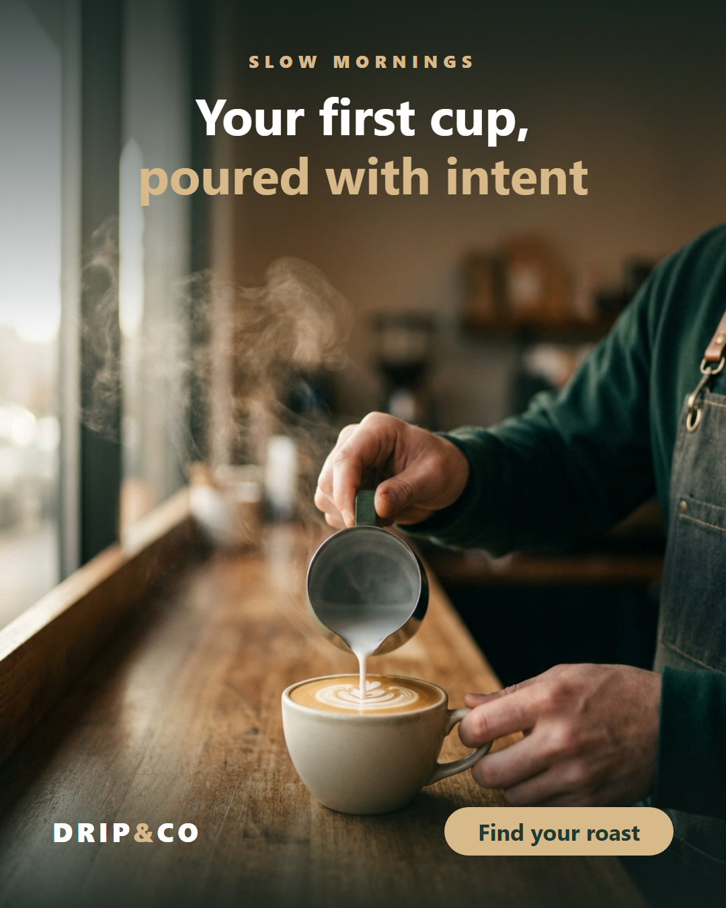
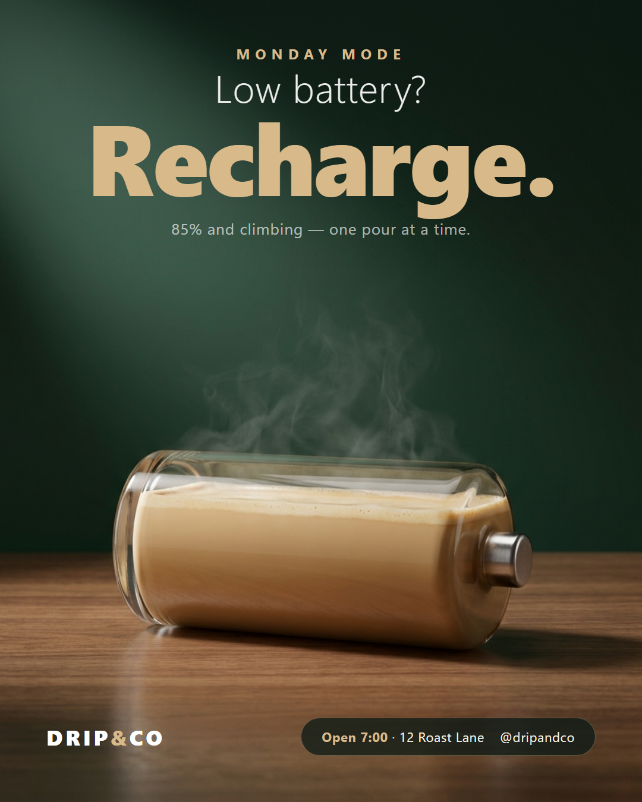

# Adloom

**Design-to-publish studio for social campaigns — as Claude Code skills.**

Adloom weaves the three strands of a social post into one loom: **image**, **copy**, and **schedule**.
Give it a brief; it generates AI image plates, composites them into a strict-grid layout with your brand
fonts and real product screenshots, writes on-voice captions in any language, and schedules the whole
week to your networks via Metricool.

Built and battle-tested end-to-end on a real 7-day bilingual (Arabic/English) campaign.

<p align="center">
  
  &nbsp;
  
  <br>
  <em>Both made entirely by Adloom. Left: strict-grid product post. Right: a <code>/adloom-concept</code> Big-Idea ad
  (phone battery built from coffee) with poster-mode typography. Reproduce them from
  <a href="examples/coffee-shop/">examples/coffee-shop</a>.</em>
</p>

```
/adloom-source ─▶ product.md + config.json      (SaaS? learn the whole product from its source code)
      │
brief ──▶ /adloom-voice ──▶ /adloom-campaign ─┬─▶ /adloom-plate    (AI imagery, one master → all ratios)
                                              ├─▶ /adloom-compose  (grid + fonts + mockups → PNGs)
                                              ├─▶ /adloom-hook     (openers) → captions
                                              ├─▶ /adloom-reel     (screencast → 9:16 mockup reel + captions)
                                              └─▶ /adloom-review   (QA every artboard)
                                                        │ pass
                                                        ▼
                                               /adloom-schedule    (Metricool → FB / IG / LinkedIn)
```

## What's inside

| Skill | Does |
|-------|------|
| `/adloom-source` | **Learn a whole SaaS from its source code** — routes, i18n, theme, fonts, logo → `product.md` + auto-filled `config.json`, no verbal brief |
| `/adloom-voice` | Build a reusable `brand-voice.md` from an interview + real samples |
| `/adloom-hook` | 6 scroll-stopping opening lines for any topic, on-voice |
| `/adloom-concept` | Creative director: 5 Big-Idea routes (visual metaphor, UI-in-real-world, scale play, cinematic portrait, type poster) with ready Gemini prompts |
| `/adloom-plate` | Gemini image plates + **extend one master across 1:1 / 4:5 / 9:16** (same image, every size) |
| `/adloom-shots` | Screen Library: Playwright-captured product screens in a versioned library for mockups |
| `/adloom-compose` | Strict-grid HTML compositing + embedded fonts → exact-pixel PNGs (headless Chrome) |
| `/adloom-reel` | **Product-in-motion Reels**: real screencast in a branded phone mockup + beat-timed burned-in captions → 9:16 mp4 (Chrome layers + ffmpeg) |
| `/adloom-campaign` | Orchestrate a full multi-day campaign end-to-end |
| `/adloom-review` | Adversarial design QA: contrast, grid, overlap, fake text, cross-ratio consistency |
| `/adloom-schedule` | Schedule to Facebook / Instagram / LinkedIn via the Metricool MCP |

## Why it's different
- **Source-aware for SaaS**: point it at your product's repo and it learns the whole system — every
  feature, the real screens, the palette and fonts — so campaigns are grounded in what the product
  actually does, with no verbal briefing. Nothing is fabricated: claims trace back to routes and labels.
- **Cross-ratio consistency**: one master image is *reframed* (image-to-image), not regenerated, so 1:1,
  4:5 and 9:16 show the same scene.
- **Pixel-identical renders**: brand fonts are embedded as base64 `@font-face` — no flaky web-font fetches
  mid-render. Absolute paths + unique user-data-dir make headless Chrome behave.
- **Real screenshots** dropped into premium phone/browser mockups, not just stock imagery.
- **One coherent look**: a strict grid (equal margins, centered header, footer on one baseline) makes a
  week of posts read as a family.
- **Actually publishes**: goes all the way to scheduled posts, including the public-image-URL workaround
  the Metricool API needs.

## Install
Requires Node 18+ and Chrome/Chromium. Reels (`/adloom-reel`) also need **ffmpeg + ffprobe** on PATH and `playwright` (`npm i -D playwright`).

```bash
git clone https://github.com/jihad1991/adloom.git
cd adloom
cp .env.example .env         # add your Google AI Studio key (GKEY)
cp config.example.json config.json   # set brand palette, fonts, ratios, hashtags
# drop your brand font files into ./fonts and your logo into ./assets
```

Use as a Claude Code plugin (add the repo as a marketplace/plugin), or copy the `skills/` folders into
your project's `.claude/skills/`.

For scheduling, connect the Metricool MCP once:
```bash
claude mcp add --transport http --scope user metricool https://ai.metricool.com/mcp
# then: /mcp  → authenticate metricool
```

## Configuration
Everything brand-specific lives in `config.json` (palette, fonts, aspect ratios, hashtags, schedule) and
secrets live in `.env` (never committed). No brand data is baked into the skills or scripts.

## Scripts
- `scripts/scan.mjs` — read a SaaS repo and emit raw product signals (routes, i18n, palette, fonts, logos) as JSON for `/adloom-source`. Zero deps, read-only. (`node scripts/scan.mjs ../my-saas product-scan.json`)
- `scripts/gen.mjs` — Gemini text-to-image plate. (`npm run plate -- out.png "4:5" "<prompt>"`)
- `scripts/gen_edit.mjs` — image-to-image reframe/extend (cross-ratio consistency, targeted edits). (`npm run extend`)
- `scripts/render.mjs` — render an HTML artboard to PNG at exact pixels via headless Chrome. (`npm run render`)
- `scripts/fontface.mjs` — embed local fonts as base64 `@font-face`.
- `scripts/screencast.mjs` — record a real product flow as video (Playwright) for a reel. (`npm run screencast`)
- `scripts/reel.mjs` — composite a screencast into a branded 9:16 phone-mockup reel with beat-timed captions (Chrome layers + ffmpeg). (`npm run reel`)

## Try it in 5 minutes
[`examples/coffee-shop/`](examples/coffee-shop/) is a complete miniature project — config, brand voice,
a 3-day campaign, and the exact commands that produced the demo image above.

## Security
- Never commit `.env`, API keys, or account IDs. `.gitignore` covers them.
- The scheduler asks for explicit confirmation before anything goes live, and only uploads images you
  approve to a public host.

## License
MIT licensed. All code and skill text in this repository are original to Adloom.
